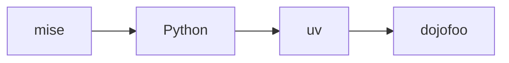

## Usage

```sh
npx dojofoo add <source>
```

Examples:

```sh
npx dojofoo add dojofoo/effect-ts
npx dojofoo add dojofoo/starter-kata
npx dojofoo add ./my-dojo
```

An `owner/repository` source is downloaded directly from a public GitHub repository.
After a successful first install, the CLI reports the canonical public repository to
the dojofoo API. The API fetches and validates its `dojo.yaml`, `dojo.yml`, or `dojo.json` itself before listing
the dojo in the marketplace. Maintainers do not submit a registry pull request.
Set `marketplace: false` in the repository manifest for private fixtures, starters, and other
public repositories that should remain installable without appearing in the marketplace.

- The source and content hash are recorded in `.dojos/<name>/.dojo-source.json`.
- A checked-in `mise.toml` or `.mise.toml` is the portable environment contract.
  dojofoo runs `mise install` and, when present, the conventional `setup` task.
- Older package-only dojos without mise still install dependencies with their
  JavaScript package manager.
- Agent commands and skills are linked into the project.
- Any dojo `prepare.sh` lifecycle script is run.

## Authoring a portable dojo

Prefer `dojo.yaml` for new courses. It uses the same schema as `dojo.json`, but
allows comments that explain authoring choices:

```yaml
# yaml-language-server: $schema=https://dojo.foo/schema/v1/dojo.json
name: "@acme/learn-python"
version: 1.0.0
description: Learn Python through a guided lesson.
mode: interactive
lessons: lessons
```

Interactive lesson steps may contain inline Markdown or point at an `.mdx`
file relative to the dojo. MDX is rendered as authored content with Markdown,
syntax-highlighted code, Mermaid diagrams, and LaTeX. The safe built-in
components are `Artifact`, `Video`, and `Interactive`:

````mdx
The dependency path is:



<Artifact src="assets/worksheet.pdf" title="Worksheet" />
<Video src="assets/introduction.mp4" title="Introduction" />
<Interactive src="components/check.html" title="Environment check" />
````

Interactive HTML runs in a sandboxed frame. Assets are served only from the
installed dojo, with path containment, type sniffing disabled, and a size
limit. Arbitrary MDX imports and executable expressions are intentionally not
part of the course contract.

Use mise to describe tools from any ecosystem and one idempotent setup task:

```toml
[tools]
python = "3.13"
uv = "latest"

[tasks.setup]
description = "Create the course environment"
run = "uv sync"
```

The learner checkout may have its own mise contract. dojofoo prepares both the
checkout and the selected course, so language setup remains owned by mise
instead of being reimplemented for Python, Go, Rust, Java, or Node.js.

## Updating a GitHub dojo

```sh
npx dojofoo update dojofoo/starter-kata
```

The update resolves the recorded source, replaces only the installed copy under
`.dojos/`, and leaves learner work, progress, sessions, and notes in place.

## Removing a dojo

Use the CLI:

```sh
npx dojofoo remove effect-ts
```

The command removes the package and refreshes the project registration.
